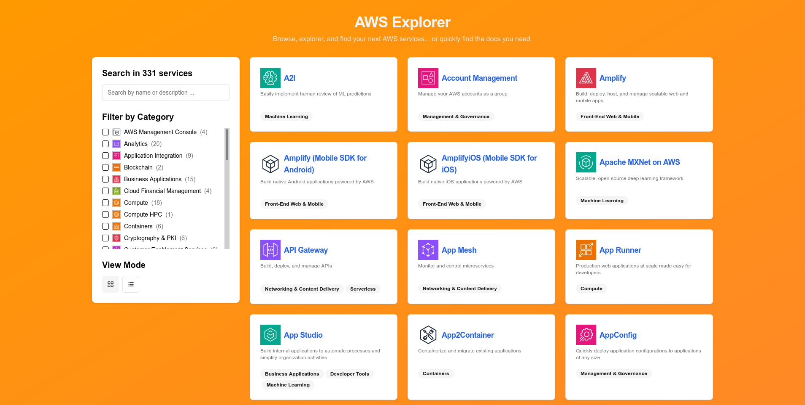

# AWS Explorer

**Live Demo** at [https://aws-explorer.vercel.app](https://aws-explorer.vercel.app)

## What is this project?

**AWS Explorer** is a web application that provides a fast, searchable, and user-friendly interface to explore Amazon Web Services (AWS) documentation. It organizes AWS services, their categories, and documentation links in a way that is easy to browse and filter.

## Who should use it?

- Developers, DevOps engineers, and cloud architects who frequently reference AWS documentation.
- Teams who want a quick reference tool for AWS services without navigating the full AWS documentation site.
- Anyone looking for a more streamlined and efficient way to discover AWS services and their official docs.

## Why you should use it

- **No pagination:** Instantly see all AWS services at once - no clicking through pages.
- **Alphabetical sorting:** Services are always sorted A–Z, so you can quickly find what you need.
- **No naming confusion:**: Don’t wonder whether it’s "Amazon S3" or “AWS S3” - just search and find it.
- **No distraction by “Amazon” or “AWS” prefixes**: Just the service name you expect.
- **Faster navigation:** Quickly search and filter AWS services by name, category, or description.
- **Better overview:** See all AWS services at a glance, with icons and short descriptions.
- **Persistent filters:** Easily share filtered views or bookmark your favorite categories.
- **Modern UI:** Enjoy a clean, responsive, and distraction-free interface.

## Comparison to the official AWS documentation page

| Feature                     | AWS Docs Explorer                                             | Official AWS Documentation                                                             |
| --------------------------- | ------------------------------------------------------------- | -------------------------------------------------------------------------------------- |
| Fast, global search         | ✅                                                            | ✅                                                                                     |
| Direct links to docs        | ✅                                                            | ✅                                                                                     |
| Category filtering          | ✅ Support multi categories                                   | 🟡 Only support one category                                                           |
| Service icons               | ✅ All services has icon. Even the categories                 | 🟡 Only for feature services                                                           |
| Preload detail page         | ✅ See it at a glance                                         | ❌ Needs a whole page load                                                             |
| Support go back             | ✅ Continue where you are before checking detail of a service | ❌ Reset everything after you checking a service                                       |
| Clean, minimal UI           | ✅                                                            | 🟡 There is a lot of information                                                       |
| Show all services           | ✅ See all the matching services                              | ❌ Navigate between pages without hope                                                 |
| No naming confusion         | ✅ VPC, EC2, S3, Lambda, CloudTrail, CloudWatch               | ❌ Amazon VPC, Amazon VPC, Amazon S3, AWS Lambda, AWS CloudTrail, Amazon CloudWatch 😕 |
| Alphabetical sorting        | ✅ VPC is near VPN, CloudTrail is next to CloudWatch          | ❌ Amazon VPC don't know AWS VPN, AWS CloudTrail never meets Amazon CloudWatch         |
| Layout mode                 | ✅ Grid, list view                                            | 🟡 Only one layout                                                                     |
| Up-to-date list of services | 🟡 Update frequently                                          | ✅ Always up-to-date                                                                   |

> [!NOTE]
> AWS Explorer is not an official AWS product. For the most current and comprehensive list of services, always refer to [AWS Documentation](https://docs.aws.amazon.com/).

## Roadmap

- [ ] Show services resources in detail page.
- [ ] Add CICD pipeline to crawl AWS docs every week.
- [ ] Support update AWS architecture icons from CICD.
- [ ] Support copy/download SVG icon.
- [ ] Show related services in detail page.

## License

[MIT License](./LICENSE)

## Credits

Inspired by the needs of the AWS developer community:

- [MKAbuMattar/aws-react-icons](https://github.com/MKAbuMattar/aws-react-icons) for source code to process the AWS Architecture Icons packages.
- [AWS architecture icons](https://aws.amazon.com/architecture/icons/) for the icons.
- [AWS Documentation](https://docs.aws.amazon.com/) for the list of services and descriptions.
- [Vercel's v0](https://v0.dev/) for providing the staring point.
- And many [others open-sourced projects](./package.json)
