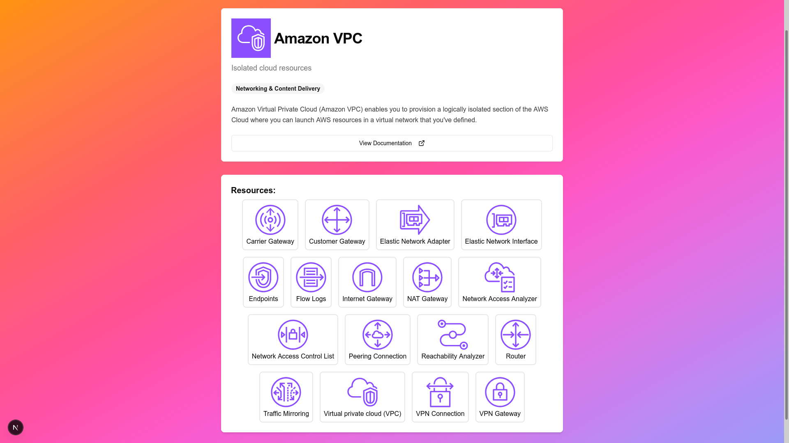

# AWS Explorer

**Live Demo** at [https://aws-explorer.vercel.app](https://aws-explorer.vercel.app)

## What is this project?

**AWS Explorer** is a web application that provides a fast, user-friendly interface to explore:

- Amazon Web Services (AWS) services
- architecture service/resources icons
- documentations

## Features

- **Homepage with search and filter**: Showing AWS services with short description and categories.

  

- **Icon Layout**: Just as in AWS architecture diagram

  

- **List Layout**: Quickly navigate between services

  

- **Resources of services**: Take a glance at the resources of each service

  

- **Detail page**: More detail about the service and its resources

  

- **Docs**: Each service is linked to docs without distraction

  

- **Responsive**: Use it at work, on the road, or at home

  | Mobile                                                                         | Table                                                                          |
  | ------------------------------------------------------------------------------ | ------------------------------------------------------------------------------ |
  |  |  |

## Who should use it?

- Developers, DevOps engineers, and cloud architects who frequently reference AWS documentation.
- Teams who want a quick reference tool for AWS services without navigating the full AWS documentation site.
- Anyone looking for a more streamlined and efficient way to discover AWS services and their official docs.

## Why you should use it

- **Alphabetical sorting:** Services are always sorted A–Z, so you can quickly find what you need.
- **No naming confusion:**: Don’t wonder whether it’s "Amazon S3" or “AWS S3” - just search and find it.
- **No distraction by “Amazon” or “AWS” prefixes**: Just the service name you expect.
- **Faster navigation:** Quickly search and filter AWS services by name, category, or description.
- **Better overview:** See all AWS services at a glance, with icons and short descriptions.
- **Persistent filters:** Easily share filtered views or bookmark your favorite categories.
- **Modern UI:** Enjoy a clean, responsive, and distraction-free interface.

## Comparison to the official AWS documentation page

| Feature                     | [AWS Explorer](https://aws-explorer.vercel.app)                                                             | [Official AWS Documentation](https://docs.aws.amazon.com/)                                             |
| --------------------------- | ----------------------------------------------------------------------------------------------------------- | ------------------------------------------------------------------------------------------------------ |
| Fast, global search         | ✅                                                                                                          | ✅                                                                                                     |
| Support abbr.               | 🚀 A2C, ADS, AMB, AMS, ARC, CDI, DLM, DMS, DRS, EFS, ELB, IAM, IVS, MGN, RAM, RDS, ROSA, SCT, SES, SMC, TNB | 🟡 Only if you're lucky                                                                                |
| Support historical name     | 🚀 CloudWatch Events, Elasticsearch Service, AWS Chatbot...                                                 | ❌ History is erased: X ~~(formerly known as Twitter)~~                                                |
| Support full name           | 🚀 Elastic Computing Cloud, Virtual Private Cloud...                                                        | ❌ I'm the captain know (EBS, EC2, ECS, ECR, EKS, EMR, MSK, MWAA, QLDB, SNS, SQS, SAM, S3 VPN, WAF...) |
| Direct links to docs        | ✅                                                                                                          | ✅                                                                                                     |
| Category filtering          | ✅ Support multi categories                                                                                 | 🟡 Only support one category                                                                           |
| Service icons               | ✅ All services have icon                                                                                   | 🟡 Only for feature services                                                                           |
| Category icons              | 🚀 All categories have icon                                                                                 | ❌ Not supported                                                                                       |
| Resources icons             | 🚀 Show resource icons in icon layout and detail page                                                       | ❌ Not supported                                                                                       |
| Service aka                 | ✅ Support aka for services, e.g. RDS, ELB, EFS                                                             | ❌ Not supported                                                                                       |
| Preload detail page         | ✅ See it at a glance                                                                                       | ❌ Needs a whole page load                                                                             |
| Links to docs               | 🚀 Show all docs of the services without distraction                                                        | ✅ Show all docs of the services but also overwhelm you with so much information                       |
| Support go back             | ✅ Continue where you are before checking detail of a service                                               | ❌ Reset everything after you checking a service                                                       |
| Clean, minimal UI           | ✅                                                                                                          | 🟡 So much distraction that you want to go and hide in the corner                                      |
| Hide/show prefix AWS/Amazon | ✅ VPC, EC2, S3, Lambda, CloudTrail, CloudWatch                                                             | ❌ Amazon VPC, Amazon VPC, Amazon S3, AWS Lambda, AWS CloudTrail, Amazon CloudWatch 😕                 |
| Sort                        | ✅ By category, service name (without/with AWS/Amazon)                                                      | ❌ Services are sorted by name with AWS/Amazon prefix                                                  |
| Alphabet sorting            | ✅ VPC is near VPN, CloudTrail is next to CloudWatch                                                        | ❌ Amazon VPC doesn't know AWS VPN, AWS CloudTrail never meets Amazon CloudWatch                       |
| Layout mode                 | 🚀 Grid, list, icon view                                                                                    | 🟡 Only one layout                                                                                     |
| Up-to-date list of services | 🟡 Update frequently                                                                                        | ✅ Always up-to-date                                                                                   |

> [!NOTE]
> AWS Explorer is not an official AWS product. For the most current and comprehensive list of services, always refer to [AWS Documentation](https://docs.aws.amazon.com/).

## Roadmap

- [x] Show services resources in detail page.
- [x] Show docs in detail page.
- [x] Hide/show prefix Amazon/AWS.
- [x] Support sort by category.
- [x] Support abbr, historical name, fullname.
- [ ] Add CI/CD pipeline to crawl AWS docs every week.
- [ ] Support update AWS architecture icons from CI/CD.
- [ ] Support copy/download SVG icon.
- [ ] Show related services in detail page.

## License

[MIT License](./LICENSE)

## Credits

Inspired by the needs of the AWS developer community:

- [MKAbuMattar/aws-react-icons](https://github.com/MKAbuMattar/aws-react-icons) for source code to process the AWS Architecture Icons packages.
- [AWS architecture icons](https://aws.amazon.com/architecture/icons/) for the icons.
- [AWS Documentation](https://docs.aws.amazon.com/) for the list of services and descriptions.
- [Vercel's v0](https://v0.dev/) for providing the staring point.
- And many [others open-sourced projects](./package.json)
